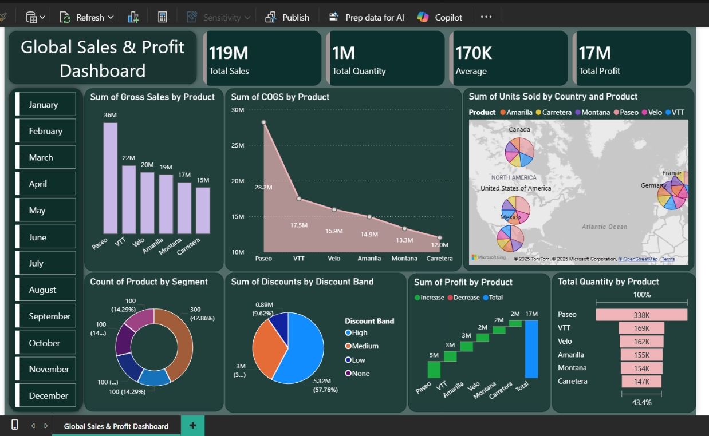

# Global Sales Dashboard (Power BI)
## 📊 Global Sales Profit Dashboard

### 🔍 Project Overview
Built an interactive Power BI dashboard analyzing 119M+ sales, generating 17M+ profit and tracking over 1M units sold.

Analyzed product, country, and discount-level data to identify top-performing products, high-revenue regions, and key business trends.

Provided actionable insights to support data-driven decision-making across different business segments

Improved decision-making by identifying revenue-driving regions and products.

### 🛠 Tools Used
Power BI | Excel | SQL (Data Cleaning)

### 📌 Key Insights
- Identified top-performing products and high-revenue regions
- Analyzed monthly sales trends to detect seasonal patterns
- Evaluated category-wise revenue contribution for business optimization

Rahul Soni
